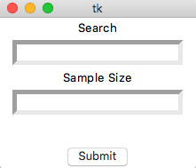
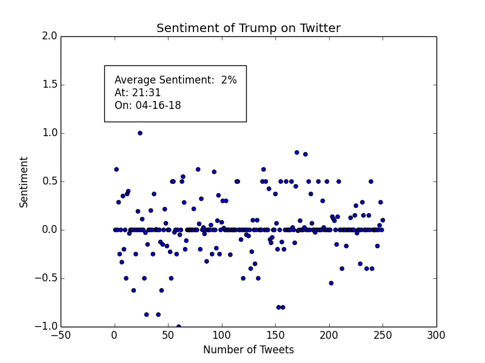

# Twitter-Data
A GUI window asks you for a keyword and sample size and analyses the sentiment of tweets about the keyword in a scatterplot. 

# Tutorial
[Here is the tutorial](https://www.google.com) I wrote on how I coded this.

# Example Run
**The GUI window that displays**

**An example scatterplot**

